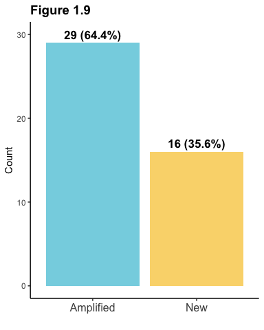
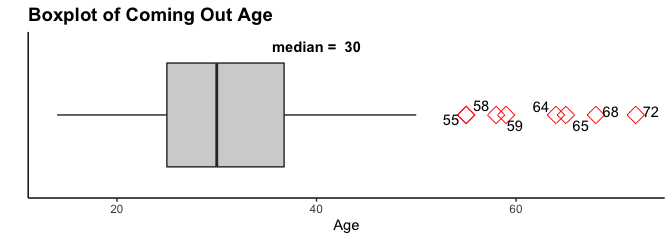
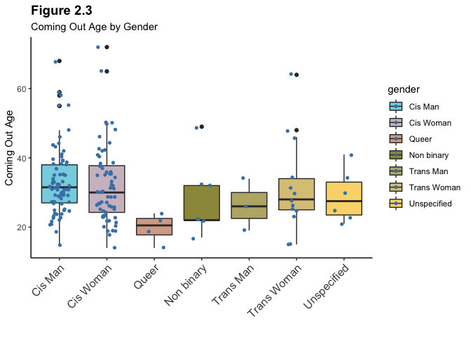

**Hollywood Closet Project:** *Exploratory Data Analysis*
================
Samuel Campione

-   <a href="#overview" id="toc-overview">Overview</a>
-   <a href="#research-questions" id="toc-research-questions"><span
    style="color: steelblue;">Research Questions</span></a>
-   <a href="#1-load-the-data-set" id="toc-1-load-the-data-set"><span
    style="color: steelblue;">1</span> <span style="color: black;">Load the
    data set</span></a>
-   <a href="#2-data-wrangling-and-cleaning"
    id="toc-2-data-wrangling-and-cleaning"><span
    style="color: steelblue;">2</span> <span style="color: black;">Data
    Wrangling and Cleaning</span></a>
-   <a href="#3-data-visualization-and-summary"
    id="toc-3-data-visualization-and-summary"><span
    style="color: steelblue;">3</span> <span style="color: black;">Data
    Visualization and Summary</span></a>
-   <a href="#31-univariate-analysis" id="toc-31-univariate-analysis"><span
    style="color: lightgrey;">3.1</span> <span
    style="color: dimgrey;">Univariate Analysis</span></a>
-   <a href="#32-multivariate-analysis"
    id="toc-32-multivariate-analysis"><span
    style="color: lightgrey;">3.2</span> <span
    style="color: dimgrey;">Multivariate Analysis</span></a>

<br>

------------------------------------------------------------------------

## Overview

##### <span style="color: dimgray;">*I worked on collecting this dataset as an RA in my undergrad. I decided to do a more in-depth analysis to see what insights may be gained about the data.*</span>

<br>

##### <span style="color: dimgray;">*Because the sample was non-randomly selected and was not designed to comply with the theoretical assumptions of statistical tests, I decided to not include inferential procedures for lack of external validity. However, the descriptive statistics and visualizations provide fascinating insight into the sample. Further, these analyses provide an idea of how the population may look.*</span>

<br>

##### <span style="color: dimgray;">*Future endeavors should focus on further collection of data to provide a more representative sample to gain firmer insight.*</span>

## <span style="color: steelblue;">Research Questions</span>

-   What do the variables in this data set look like with descriptive
    statistics and data visualization?
-   How has the age of coming out changed over time?
-   Are people coming out at a younger age in more recent years?
-   How do all of these look across race, gender, and sexuality?

------------------------------------------------------------------------

## <span style="color: steelblue;">1</span> <span style="color: black;">Load the data set</span>

------------------------------------------------------------------------

``` r
options(warn = -1) # Turn off warning messages

# Load required libraries
suppressMessages(library(tidyverse))
suppressMessages(library(wesanderson))
suppressMessages(library(forcats))
suppressMessages(library(knitr))
suppressMessages(library(kableExtra))
suppressMessages(library(ggrepel))
suppressMessages(library(patchwork))
```

<br>

### <span style="color: lightgray;">1.1</span> Read in the file

``` r
data <- read.csv("HCP_data.csv", na.strings = c("","NA"))
```

<br>

### <span style="color: lightgray;">1.2</span> Preview the `data`

``` r
head(data)
```

<div data-pagedtable="false">

<script data-pagedtable-source type="application/json">
{"columns":[{"label":[""],"name":["_rn_"],"type":[""],"align":["left"]},{"label":["ID"],"name":[1],"type":["int"],"align":["right"]},{"label":["First.Name"],"name":[2],"type":["chr"],"align":["left"]},{"label":["Last.Name"],"name":[3],"type":["chr"],"align":["left"]},{"label":["Race.Ethnicity"],"name":[4],"type":["chr"],"align":["left"]},{"label":["Birth.Year"],"name":[5],"type":["int"],"align":["right"]},{"label":["Coming.Out.Age"],"name":[6],"type":["int"],"align":["right"]},{"label":["Coming.Out.Year"],"name":[7],"type":["int"],"align":["right"]},{"label":["Coming.Out.Medium"],"name":[8],"type":["chr"],"align":["left"]},{"label":["Type.of.Outing.Initiation"],"name":[9],"type":["chr"],"align":["left"]},{"label":["Type.of.Outing.Who.discloses."],"name":[10],"type":["chr"],"align":["left"]},{"label":["Public.Sexual.Identity"],"name":[11],"type":["chr"],"align":["left"]},{"label":["Were.they.in..the.closet.."],"name":[12],"type":["chr"],"align":["left"]},{"label":["Public.Gender.Identity"],"name":[13],"type":["chr"],"align":["left"]},{"label":["X2nd.Coming.Out..Nature"],"name":[14],"type":["chr"],"align":["left"]},{"label":["X2nd.Coming.Out..Sexual.ID"],"name":[15],"type":["chr"],"align":["left"]}],"data":[{"1":"1","2":"Jackie","3":"Abbott","4":"White","5":"1992","6":"30","7":"2017","8":"Social Media","9":"Other initiated","10":"Other's words","11":"Unspecified","12":"Unclear","13":"Cis Woman","14":"NA","15":"NA","_rn_":"1"},{"1":"2","2":"Ali","3":"Adler","4":"White","5":"1967","6":"20","7":"1987","8":"Print","9":"Self initiated","10":"Own words","11":"Lesbian","12":"Unclear","13":"Cis Woman","14":"Amplified","15":"Lesbian","_rn_":"2"},{"1":"3","2":"James","3":"Adomian","4":"White","5":"1980","6":"30","7":"2010","8":"Online","9":"Other initiated","10":"Other's words","11":"Gay","12":"Yes","13":"Cis Man","14":"NA","15":"NA","_rn_":"3"},{"1":"4","2":"Roberto","3":"Aguirre Sacasa","4":"Latinx","5":"1973","6":"31","7":"2004","8":"Print","9":"Other initiated","10":"Other's words","11":"Gay","12":"No","13":"Cis Man","14":"NA","15":"NA","_rn_":"4"},{"1":"5","2":"Clay","3":"Aiken","4":"White","5":"1978","6":"29","7":"2007","8":"Print","9":"Self initiated","10":"Own words","11":"Gay","12":"Unclear","13":"Cis Man","14":"NA","15":"NA","_rn_":"5"},{"1":"6","2":"Loretta Mary","3":"Aiken","4":"Black","5":"1894","6":"27","7":"1921","8":"NA","9":"NA","10":"NA","11":"Unspecified","12":"NA","13":"Cis Woman","14":"Amplified","15":"Lesbian","_rn_":"6"}],"options":{"columns":{"min":{},"max":[10]},"rows":{"min":[10],"max":[10]},"pages":{}}}
  </script>

</div>

<br>

------------------------------------------------------------------------

## <span style="color: steelblue;">2</span> <span style="color: black;">Data Wrangling and Cleaning</span>

------------------------------------------------------------------------

<br>

### <span style="color: lightgrey;">2.1</span> Relabel columns

``` r
colnames(data) = c("id", "first_name", "last_name", "race", "birth_year", "age", 
                  "coming_out_year", "medium", "initiation", "disclosure", "sexuality", 
                  "closeted", "gender", "coming_out_nature_2", "sexuality_2")
```

<br>

### <span style="color: lightgrey;">2.2</span> Merge `first_name` and `last_name`

``` r
data <- data %>%
  unite("name", first_name:last_name, sep=" ")
```

<br>

### <span style="color: lightgrey;">2.3</span> Convert variables to correct data types

``` r
# All character variables to factors
data <- data %>%
  mutate_if(sapply(data, is.character), as.factor)
```

<br>

### <span style="color: lightgrey;">2.4</span> Create variable `coming_out_2` to easily explore subset

``` r
data<- data %>% 
  mutate(coming_out_2 = ifelse(is.na(coming_out_nature_2), 0, 1) ,.after = gender)
```

<br>

------------------------------------------------------------------------

## <span style="color: steelblue;">3</span> <span style="color: black;">Data Visualization and Summary</span>

------------------------------------------------------------------------

<br>

## <span style="color: lightgrey;">3.1</span> <span style="color: dimgrey;">Univariate Analysis</span>

<br>

------------------------------------------------------------------------

### <span style="color: lightgrey;">3.1.1</span> <span style="color: steelblue;">Race</span>


<table style="width:65%; font-family: &quot;Arial Narrow&quot;, &quot;Source Sans Pro&quot;, sans-serif; margin-left: auto; margin-right: auto; font-size: 18px; margin-left: auto; margin-right: auto;" class=" lightable-classic table table-striped">
<caption style="font-size: initial !important;">
TABLE 1.1: Race
</caption>
<thead>
<tr>
<th style="text-align:left;font-weight: bold;">
Race
</th>
<th style="text-align:right;font-weight: bold;">
Frequency
</th>
<th style="text-align:right;font-weight: bold;">
Relative Frequency
</th>
</tr>
</thead>
<tbody>
<tr>
<td style="text-align:left;">
Asian
</td>
<td style="text-align:right;">
14
</td>
<td style="text-align:right;">
0.080
</td>
</tr>
<tr>
<td style="text-align:left;">
Black
</td>
<td style="text-align:right;">
28
</td>
<td style="text-align:right;">
0.159
</td>
</tr>
<tr>
<td style="text-align:left;">
Latinx
</td>
<td style="text-align:right;">
22
</td>
<td style="text-align:right;">
0.125
</td>
</tr>
<tr>
<td style="text-align:left;">
Multiracial
</td>
<td style="text-align:right;">
12
</td>
<td style="text-align:right;">
0.068
</td>
</tr>
<tr>
<td style="text-align:left;">
Unknown
</td>
<td style="text-align:right;">
1
</td>
<td style="text-align:right;">
0.006
</td>
</tr>
<tr>
<td style="text-align:left;">
White
</td>
<td style="text-align:right;">
99
</td>
<td style="text-align:right;">
0.562
</td>
</tr>
</tbody>
</table>

<br>

#### <span style="color: grey;">Any missing values?</span>

    ## [1] "Missing Values (NAs): 0"

<br>

------------------------------------------------------------------------

### <span style="color: lightgrey;">3.1.2</span> <span style="color: steelblue;">Gender</span>


<table style="width:65%; font-family: &quot;Arial Narrow&quot;, &quot;Source Sans Pro&quot;, sans-serif; margin-left: auto; margin-right: auto; font-size: 18px; margin-left: auto; margin-right: auto;" class=" lightable-classic table table-striped">
<caption style="font-size: initial !important;">
TABLE 1.2: Gender
</caption>
<thead>
<tr>
<th style="text-align:left;font-weight: bold;">
Gender
</th>
<th style="text-align:right;font-weight: bold;">
Frequency
</th>
<th style="text-align:right;font-weight: bold;">
Relative Frequency
</th>
</tr>
</thead>
<tbody>
<tr>
<td style="text-align:left;">
Cis Man
</td>
<td style="text-align:right;">
76
</td>
<td style="text-align:right;">
0.434
</td>
</tr>
<tr>
<td style="text-align:left;">
Cis Woman
</td>
<td style="text-align:right;">
65
</td>
<td style="text-align:right;">
0.371
</td>
</tr>
<tr>
<td style="text-align:left;">
Genderqueer
</td>
<td style="text-align:right;">
1
</td>
<td style="text-align:right;">
0.006
</td>
</tr>
<tr>
<td style="text-align:left;">
Non binary
</td>
<td style="text-align:right;">
7
</td>
<td style="text-align:right;">
0.040
</td>
</tr>
<tr>
<td style="text-align:left;">
Queer
</td>
<td style="text-align:right;">
2
</td>
<td style="text-align:right;">
0.011
</td>
</tr>
<tr>
<td style="text-align:left;">
Trans Man
</td>
<td style="text-align:right;">
3
</td>
<td style="text-align:right;">
0.017
</td>
</tr>
<tr>
<td style="text-align:left;">
Trans Woman
</td>
<td style="text-align:right;">
13
</td>
<td style="text-align:right;">
0.074
</td>
</tr>
<tr>
<td style="text-align:left;">
Unspecified
</td>
<td style="text-align:right;">
7
</td>
<td style="text-align:right;">
0.040
</td>
</tr>
<tr>
<td style="text-align:left;">
Unspecified queer
</td>
<td style="text-align:right;">
1
</td>
<td style="text-align:right;">
0.006
</td>
</tr>
</tbody>
</table>

<br>

#### <span style="color: grey;">Any missing values?</span>

    ## [1] "Missing Values (NAs): 1"

<br>

------------------------------------------------------------------------

### <span style="color: lightgrey;">3.1.3</span> <span style="color: steelblue;">Sexuality</span>


<table style="width:60%; font-family: &quot;Arial Narrow&quot;, &quot;Source Sans Pro&quot;, sans-serif; margin-left: auto; margin-right: auto; font-size: 18px; margin-left: auto; margin-right: auto;" class=" lightable-classic table table-striped">
<caption style="font-size: initial !important;">
TABLE 1.3: Sexuality
</caption>
<thead>
<tr>
<th style="text-align:left;font-weight: bold;">
Sexuality
</th>
<th style="text-align:right;font-weight: bold;">
Frequency
</th>
<th style="text-align:right;font-weight: bold;">
Relative Frequency
</th>
</tr>
</thead>
<tbody>
<tr>
<td style="text-align:left;">
Bisexual
</td>
<td style="text-align:right;">
20
</td>
<td style="text-align:right;">
0.119
</td>
</tr>
<tr>
<td style="text-align:left;">
Gay
</td>
<td style="text-align:right;">
64
</td>
<td style="text-align:right;">
0.381
</td>
</tr>
<tr>
<td style="text-align:left;">
Heterosexual
</td>
<td style="text-align:right;">
5
</td>
<td style="text-align:right;">
0.030
</td>
</tr>
<tr>
<td style="text-align:left;">
Lesbian
</td>
<td style="text-align:right;">
21
</td>
<td style="text-align:right;">
0.125
</td>
</tr>
<tr>
<td style="text-align:left;">
Pansexual
</td>
<td style="text-align:right;">
1
</td>
<td style="text-align:right;">
0.006
</td>
</tr>
<tr>
<td style="text-align:left;">
Queer
</td>
<td style="text-align:right;">
13
</td>
<td style="text-align:right;">
0.077
</td>
</tr>
<tr>
<td style="text-align:left;">
Sexually fluid
</td>
<td style="text-align:right;">
1
</td>
<td style="text-align:right;">
0.006
</td>
</tr>
<tr>
<td style="text-align:left;">
Unspecified
</td>
<td style="text-align:right;">
30
</td>
<td style="text-align:right;">
0.179
</td>
</tr>
<tr>
<td style="text-align:left;">
Non heterosexual
</td>
<td style="text-align:right;">
13
</td>
<td style="text-align:right;">
0.077
</td>
</tr>
</tbody>
</table>

<br>

#### <span style="color: grey;">Any missing values?</span>

    ## [1] "Missing Values (NAs): 8"

<br>

------------------------------------------------------------------------

### <span style="color: lightgrey;">3.1.2</span> <span style="color: steelblue;">In the closet?</span>


<table style="width:65%; font-family: &quot;Arial Narrow&quot;, &quot;Source Sans Pro&quot;, sans-serif; margin-left: auto; margin-right: auto; font-size: 18px; margin-left: auto; margin-right: auto;" class=" lightable-classic table table-striped">
<caption style="font-size: initial !important;">
TABLE 1.4: Closeted before coming out
</caption>
<thead>
<tr>
<th style="text-align:left;font-weight: bold;">
Closeted?
</th>
<th style="text-align:right;font-weight: bold;">
Frequency
</th>
<th style="text-align:right;font-weight: bold;">
Relative Frequency
</th>
</tr>
</thead>
<tbody>
<tr>
<td style="text-align:left;">
No
</td>
<td style="text-align:right;">
66
</td>
<td style="text-align:right;">
0.398
</td>
</tr>
<tr>
<td style="text-align:left;">
No but not publicly out
</td>
<td style="text-align:right;">
3
</td>
<td style="text-align:right;">
0.018
</td>
</tr>
<tr>
<td style="text-align:left;">
Unclear
</td>
<td style="text-align:right;">
45
</td>
<td style="text-align:right;">
0.271
</td>
</tr>
<tr>
<td style="text-align:left;">
Yes
</td>
<td style="text-align:right;">
50
</td>
<td style="text-align:right;">
0.301
</td>
</tr>
<tr>
<td style="text-align:left;">
Yes but rumored
</td>
<td style="text-align:right;">
2
</td>
<td style="text-align:right;">
0.012
</td>
</tr>
</tbody>
</table>

<br>

#### <span style="color: grey;">Any missing values?</span>

    ## [1] "Missing Values (NAs): 10"

<br>

------------------------------------------------------------------------

### <span style="color: lightgrey;">3.1.5</span> <span style="color: steelblue;">Coming Out Medium</span>


<table style="width:65%; font-family: &quot;Arial Narrow&quot;, &quot;Source Sans Pro&quot;, sans-serif; margin-left: auto; margin-right: auto; font-size: 18px; margin-left: auto; margin-right: auto;" class=" lightable-classic table table-striped">
<caption style="font-size: initial !important;">
TABLE 1.5: Medium of coming out
</caption>
<thead>
<tr>
<th style="text-align:left;font-weight: bold;">
Medium
</th>
<th style="text-align:right;font-weight: bold;">
Frequency
</th>
<th style="text-align:right;font-weight: bold;">
Relative Frequency
</th>
</tr>
</thead>
<tbody>
<tr>
<td style="text-align:left;">
Article
</td>
<td style="text-align:right;">
1
</td>
<td style="text-align:right;">
0.006
</td>
</tr>
<tr>
<td style="text-align:left;">
Broadcast Media
</td>
<td style="text-align:right;">
27
</td>
<td style="text-align:right;">
0.161
</td>
</tr>
<tr>
<td style="text-align:left;">
Misc
</td>
<td style="text-align:right;">
12
</td>
<td style="text-align:right;">
0.071
</td>
</tr>
<tr>
<td style="text-align:left;">
Online
</td>
<td style="text-align:right;">
51
</td>
<td style="text-align:right;">
0.304
</td>
</tr>
<tr>
<td style="text-align:left;">
Print
</td>
<td style="text-align:right;">
40
</td>
<td style="text-align:right;">
0.238
</td>
</tr>
<tr>
<td style="text-align:left;">
Social Media
</td>
<td style="text-align:right;">
37
</td>
<td style="text-align:right;">
0.220
</td>
</tr>
</tbody>
</table>

<br>

#### <span style="color: grey;">Any missing values?</span>

    ## [1] "Missing Values (NAs): 8"

<br>

------------------------------------------------------------------------

### <span style="color: lightgrey;">3.1.6</span> <span style="color: steelblue;">Who Initiated Coming Out?</span>


<table style="width:65%; font-family: &quot;Arial Narrow&quot;, &quot;Source Sans Pro&quot;, sans-serif; margin-left: auto; margin-right: auto; font-size: 18px; margin-left: auto; margin-right: auto;" class=" lightable-classic table table-striped">
<caption style="font-size: initial !important;">
TABLE 1.6: Who initiated coming out
</caption>
<thead>
<tr>
<th style="text-align:left;font-weight: bold;">
Initiation
</th>
<th style="text-align:right;font-weight: bold;">
Frequency
</th>
<th style="text-align:right;font-weight: bold;">
Relative Frequency
</th>
</tr>
</thead>
<tbody>
<tr>
<td style="text-align:left;">
Other initiated
</td>
<td style="text-align:right;">
41
</td>
<td style="text-align:right;">
0.247
</td>
</tr>
<tr>
<td style="text-align:left;">
Self initiated
</td>
<td style="text-align:right;">
125
</td>
<td style="text-align:right;">
0.753
</td>
</tr>
</tbody>
</table>

<br>

#### <span style="color: grey;">Any missing values?</span>

    ## [1] "Missing Values (NAs): 10"

<br>

------------------------------------------------------------------------

### <span style="color: lightgrey;">3.1.7</span> <span style="color: steelblue;">Who Disclosed?</span>


<table style="width:65%; font-family: &quot;Arial Narrow&quot;, &quot;Source Sans Pro&quot;, sans-serif; margin-left: auto; margin-right: auto; font-size: 18px; margin-left: auto; margin-right: auto;" class=" lightable-classic table table-striped">
<caption style="font-size: initial !important;">
TABLE 1.7: Who disclosed
</caption>
<thead>
<tr>
<th style="text-align:left;font-weight: bold;">
Disclosure
</th>
<th style="text-align:right;font-weight: bold;">
Frequency
</th>
<th style="text-align:right;font-weight: bold;">
Relative Frequency
</th>
</tr>
</thead>
<tbody>
<tr>
<td style="text-align:left;">
Other’s words
</td>
<td style="text-align:right;">
31
</td>
<td style="text-align:right;">
0.188
</td>
</tr>
<tr>
<td style="text-align:left;">
Own words
</td>
<td style="text-align:right;">
134
</td>
<td style="text-align:right;">
0.812
</td>
</tr>
</tbody>
</table>

<br>

#### <span style="color: grey;">Any missing values?</span>

    ## [1] "Missing Values (NAs): 11"

<br>

------------------------------------------------------------------------

### <span style="color: lightgrey;">3.1.8</span> <span style="color: steelblue;">Had Second Coming Out?</span>


<table style="width:65%; font-family: &quot;Arial Narrow&quot;, &quot;Source Sans Pro&quot;, sans-serif; margin-left: auto; margin-right: auto; font-size: 18px; margin-left: auto; margin-right: auto;" class=" lightable-classic table table-striped">
<caption style="font-size: initial !important;">
TABLE 1.8: Second coming out events
</caption>
<thead>
<tr>
<th style="text-align:left;font-weight: bold;">
Had 2nd Coming Out
</th>
<th style="text-align:right;font-weight: bold;">
Frequency
</th>
<th style="text-align:right;font-weight: bold;">
Relative Frequency
</th>
</tr>
</thead>
<tbody>
<tr>
<td style="text-align:left;">
No
</td>
<td style="text-align:right;">
131
</td>
<td style="text-align:right;">
0.74
</td>
</tr>
<tr>
<td style="text-align:left;">
Yes
</td>
<td style="text-align:right;">
45
</td>
<td style="text-align:right;">
0.26
</td>
</tr>
</tbody>
</table>

<br>

#### <span style="color: grey;">Any missing values?</span>

    ## [1] "Missing Values (NAs): 0"

<br>

------------------------------------------------------------------------

### <span style="color: lightgrey;">3.1.9</span> <span style="color: steelblue;">Second Coming Out Nature</span>



<table style="width:65%; font-family: &quot;Arial Narrow&quot;, &quot;Source Sans Pro&quot;, sans-serif; margin-left: auto; margin-right: auto; font-size: 18px; margin-left: auto; margin-right: auto;" class=" lightable-classic table table-striped">
<caption style="font-size: initial !important;">
TABLE 1.9: Nature of second coming out
</caption>
<thead>
<tr>
<th style="text-align:left;font-weight: bold;">
Nature
</th>
<th style="text-align:right;font-weight: bold;">
Frequency
</th>
<th style="text-align:right;font-weight: bold;">
Relative Frequency
</th>
</tr>
</thead>
<tbody>
<tr>
<td style="text-align:left;">
Amplified
</td>
<td style="text-align:right;">
29
</td>
<td style="text-align:right;">
0.64
</td>
</tr>
<tr>
<td style="text-align:left;">
New
</td>
<td style="text-align:right;">
16
</td>
<td style="text-align:right;">
0.36
</td>
</tr>
</tbody>
</table>

<br>

#### <span style="color: grey;">Any missing values?</span>

    ## [1] "Missing Values (NAs): 0"

<br>

------------------------------------------------------------------------

### <span style="color: lightgrey;">3.1.10</span> <span style="color: steelblue;">Second Coming Out Sexuality</span>


<table style="width:75%; font-family: &quot;Arial Narrow&quot;, &quot;Source Sans Pro&quot;, sans-serif; margin-left: auto; margin-right: auto; font-size: 18px; margin-left: auto; margin-right: auto;" class=" lightable-classic table table-striped">
<caption style="font-size: initial !important;">
TABLE 1.10: Sexuality at second coming out
</caption>
<thead>
<tr>
<th style="text-align:left;font-weight: bold;">
Sexuality
</th>
<th style="text-align:right;font-weight: bold;">
Frequency
</th>
<th style="text-align:right;font-weight: bold;">
Relative Frequency
</th>
</tr>
</thead>
<tbody>
<tr>
<td style="text-align:left;">
Bisexual
</td>
<td style="text-align:right;">
2
</td>
<td style="text-align:right;">
0.05
</td>
</tr>
<tr>
<td style="text-align:left;">
Gay
</td>
<td style="text-align:right;">
14
</td>
<td style="text-align:right;">
0.33
</td>
</tr>
<tr>
<td style="text-align:left;">
Heterosexual
</td>
<td style="text-align:right;">
1
</td>
<td style="text-align:right;">
0.02
</td>
</tr>
<tr>
<td style="text-align:left;">
Lesbian
</td>
<td style="text-align:right;">
6
</td>
<td style="text-align:right;">
0.14
</td>
</tr>
<tr>
<td style="text-align:left;">
Pansexual
</td>
<td style="text-align:right;">
3
</td>
<td style="text-align:right;">
0.07
</td>
</tr>
<tr>
<td style="text-align:left;">
Queer
</td>
<td style="text-align:right;">
4
</td>
<td style="text-align:right;">
0.09
</td>
</tr>
<tr>
<td style="text-align:left;">
Sexually fluid
</td>
<td style="text-align:right;">
1
</td>
<td style="text-align:right;">
0.02
</td>
</tr>
<tr>
<td style="text-align:left;">
Unspecified
</td>
<td style="text-align:right;">
9
</td>
<td style="text-align:right;">
0.21
</td>
</tr>
<tr>
<td style="text-align:left;">
Non heterosexual
</td>
<td style="text-align:right;">
3
</td>
<td style="text-align:right;">
0.07
</td>
</tr>
</tbody>
</table>

<br>

#### <span style="color: grey;">Any missing values?</span>

    ## [1] "Missing Values (NAs): 2"

<br>

### <span style="color: lightgrey;">3.1.11</span> <span style="color: steelblue;">Current Age</span>

<br>

#### Current ages in 2022 based on birth year. For simplicity, I applied a filter to include only those under 100 years old


<br>

<br>
<table style="width:40%; font-family: &quot;Arial Narrow&quot;, &quot;Source Sans Pro&quot;, sans-serif; margin-left: auto; margin-right: auto; font-size: 20px; margin-left: auto; margin-right: auto;" class=" lightable-classic table table-striped">
<caption style="font-size: initial !important;">
TABLE 1.11: Summary of Current Ages
</caption>
<thead>
<tr>
<th style="text-align:right;font-weight: bold;">
Mean
</th>
<th style="text-align:right;font-weight: bold;">
SD
</th>
<th style="text-align:right;font-weight: bold;">
Median
</th>
<th style="text-align:right;font-weight: bold;">
Min
</th>
<th style="text-align:right;font-weight: bold;">
Max
</th>
<th style="text-align:right;font-weight: bold;">
NAs
</th>
</tr>
</thead>
<tbody>
<tr>
<td style="text-align:right;">
45.6
</td>
<td style="text-align:right;">
17.6
</td>
<td style="text-align:right;">
41
</td>
<td style="text-align:right;">
21
</td>
<td style="text-align:right;">
128
</td>
<td style="text-align:right;">
3
</td>
</tr>
</tbody>
</table>

<br>

------------------------------------------------------------------------

### <span style="color: lightgrey;">3.1.12</span> <span style="color: steelblue;">Coming Out Year</span>


<br>


<br>
<table style="width:45%; font-family: &quot;Arial Narrow&quot;, &quot;Source Sans Pro&quot;, sans-serif; margin-left: auto; margin-right: auto; font-size: 20px; margin-left: auto; margin-right: auto;" class=" lightable-classic table table-striped">
<caption style="font-size: initial !important;">
TABLE 1.12: Summary of Coming Out Years
</caption>
<thead>
<tr>
<th style="text-align:right;font-weight: bold;">
Mean
</th>
<th style="text-align:right;font-weight: bold;">
SD
</th>
<th style="text-align:right;font-weight: bold;">
Median
</th>
<th style="text-align:right;font-weight: bold;">
Min
</th>
<th style="text-align:right;font-weight: bold;">
Max
</th>
<th style="text-align:right;font-weight: bold;">
NAs
</th>
</tr>
</thead>
<tbody>
<tr>
<td style="text-align:right;">
2008
</td>
<td style="text-align:right;">
14
</td>
<td style="text-align:right;">
2011
</td>
<td style="text-align:right;">
1921
</td>
<td style="text-align:right;">
2021
</td>
<td style="text-align:right;">
0
</td>
</tr>
</tbody>
</table>

<br>

------------------------------------------------------------------------

### <span style="color: lightgrey;">3.1.13</span> <span style="color: steelblue;">Age at Coming Out</span>


<br>



<table style="width:40%; font-family: &quot;Arial Narrow&quot;, &quot;Source Sans Pro&quot;, sans-serif; margin-left: auto; margin-right: auto; font-size: 20px; margin-left: auto; margin-right: auto;" class=" lightable-classic table table-striped">
<caption style="font-size: initial !important;">
TABLE 1.13: Summary of Coming Out Age
</caption>
<thead>
<tr>
<th style="text-align:right;font-weight: bold;">
Mean
</th>
<th style="text-align:right;font-weight: bold;">
SD
</th>
<th style="text-align:right;font-weight: bold;">
Median
</th>
<th style="text-align:right;font-weight: bold;">
Min
</th>
<th style="text-align:right;font-weight: bold;">
Max
</th>
<th style="text-align:right;font-weight: bold;">
NAs
</th>
</tr>
</thead>
<tbody>
<tr>
<td style="text-align:right;">
31.8
</td>
<td style="text-align:right;">
10.6
</td>
<td style="text-align:right;">
30
</td>
<td style="text-align:right;">
14
</td>
<td style="text-align:right;">
72
</td>
<td style="text-align:right;">
0
</td>
</tr>
</tbody>
</table>

<br>

------------------------------------------------------------------------

## <span style="color: lightgrey;">3.2</span> <span style="color: dimgrey;">Multivariate Analysis</span>

<br>

------------------------------------------------------------------------

### <span style="color: lightgrey;">3.2.1</span> <span style="color: steelblue">Coming Out Age & Birth Year</span>

#### <span style="color: grey;">Are younger generations coming out at a younger age?</span>


<br>

<table style="width:50%; font-family: &quot;Arial Narrow&quot;, &quot;Source Sans Pro&quot;, sans-serif; margin-left: auto; margin-right: auto; font-size: 20px; margin-left: auto; margin-right: auto;" class=" lightable-classic table table-striped">
<caption style="font-size: initial !important;">
TABLE 2.1: Birth Decade and Coming Out Age
</caption>
<thead>
<tr>
<th style="text-align:left;font-weight: bold;">
Decade
</th>
<th style="text-align:right;font-weight: bold;">
Count
</th>
<th style="text-align:right;font-weight: bold;">
Mean Coming Out Age
</th>
</tr>
</thead>
<tbody>
<tr>
<td style="text-align:left;">
Pre-Boomer
</td>
<td style="text-align:right;">
10
</td>
<td style="text-align:right;">
47.70
</td>
</tr>
<tr>
<td style="text-align:left;">
Boomer
</td>
<td style="text-align:right;">
21
</td>
<td style="text-align:right;">
42.14
</td>
</tr>
<tr>
<td style="text-align:left;">
Gen X
</td>
<td style="text-align:right;">
40
</td>
<td style="text-align:right;">
35.58
</td>
</tr>
<tr>
<td style="text-align:left;">
Millenial
</td>
<td style="text-align:right;">
89
</td>
<td style="text-align:right;">
27.52
</td>
</tr>
<tr>
<td style="text-align:left;">
Gen Z
</td>
<td style="text-align:right;">
10
</td>
<td style="text-align:right;">
17.30
</td>
</tr>
</tbody>
</table>

<br>

------------------------------------------------------------------------

### <span style="color: lightgrey;">3.2.2.</span> <span style="color: steelblue">Coming Out Age & Race</span>

#### <span style="color: grey;">What does coming out age look across race?</span>


<br>

<table style="width:50%; font-family: &quot;Arial Narrow&quot;, &quot;Source Sans Pro&quot;, sans-serif; margin-left: auto; margin-right: auto; font-size: 20px; margin-left: auto; margin-right: auto;" class=" lightable-classic table table-striped">
<caption style="font-size: initial !important;">
TABLE 2.2: Race and Coming Out Age
</caption>
<thead>
<tr>
<th style="text-align:left;font-weight: bold;">
Race
</th>
<th style="text-align:right;font-weight: bold;">
Count
</th>
<th style="text-align:right;font-weight: bold;">
Mean
</th>
<th style="text-align:right;font-weight: bold;">
Median
</th>
<th style="text-align:right;font-weight: bold;">
Min
</th>
<th style="text-align:right;font-weight: bold;">
Max
</th>
</tr>
</thead>
<tbody>
<tr>
<td style="text-align:left;">
Asian
</td>
<td style="text-align:right;">
14
</td>
<td style="text-align:right;">
35.64
</td>
<td style="text-align:right;">
31.5
</td>
<td style="text-align:right;">
23
</td>
<td style="text-align:right;">
68
</td>
</tr>
<tr>
<td style="text-align:left;">
Black
</td>
<td style="text-align:right;">
27
</td>
<td style="text-align:right;">
32.11
</td>
<td style="text-align:right;">
31.0
</td>
<td style="text-align:right;">
21
</td>
<td style="text-align:right;">
55
</td>
</tr>
<tr>
<td style="text-align:left;">
Latinx
</td>
<td style="text-align:right;">
21
</td>
<td style="text-align:right;">
28.90
</td>
<td style="text-align:right;">
27.0
</td>
<td style="text-align:right;">
19
</td>
<td style="text-align:right;">
41
</td>
</tr>
<tr>
<td style="text-align:left;">
Multiracial
</td>
<td style="text-align:right;">
12
</td>
<td style="text-align:right;">
24.67
</td>
<td style="text-align:right;">
25.0
</td>
<td style="text-align:right;">
15
</td>
<td style="text-align:right;">
33
</td>
</tr>
<tr>
<td style="text-align:left;">
Unknown
</td>
<td style="text-align:right;">
1
</td>
<td style="text-align:right;">
41.00
</td>
<td style="text-align:right;">
41.0
</td>
<td style="text-align:right;">
41
</td>
<td style="text-align:right;">
41
</td>
</tr>
<tr>
<td style="text-align:left;">
White
</td>
<td style="text-align:right;">
95
</td>
<td style="text-align:right;">
32.60
</td>
<td style="text-align:right;">
31.0
</td>
<td style="text-align:right;">
14
</td>
<td style="text-align:right;">
72
</td>
</tr>
</tbody>
</table>

<br>

------------------------------------------------------------------------

### <span style="color: lightgrey;">3.2.3</span> <span style="color: steelblue">Coming Out Age & Gender</span>

#### <span style="color: grey;">What does coming out age look across gender?</span>



<br>

<table style="width:60%; font-family: &quot;Arial Narrow&quot;, &quot;Source Sans Pro&quot;, sans-serif; margin-left: auto; margin-right: auto; font-size: 20px; margin-left: auto; margin-right: auto;" class=" lightable-classic table table-striped">
<caption style="font-size: initial !important;">
TABLE 2.3: Gender and Coming Out Age
</caption>
<thead>
<tr>
<th style="text-align:left;font-weight: bold;">
Gender
</th>
<th style="text-align:right;font-weight: bold;">
Count
</th>
<th style="text-align:right;font-weight: bold;">
Mean
</th>
<th style="text-align:right;font-weight: bold;">
Median
</th>
<th style="text-align:right;font-weight: bold;">
Min
</th>
<th style="text-align:right;font-weight: bold;">
Max
</th>
</tr>
</thead>
<tbody>
<tr>
<td style="text-align:left;">
Cis Man
</td>
<td style="text-align:right;">
74
</td>
<td style="text-align:right;">
33.16
</td>
<td style="text-align:right;">
31.5
</td>
<td style="text-align:right;">
15
</td>
<td style="text-align:right;">
68
</td>
</tr>
<tr>
<td style="text-align:left;">
Cis Woman
</td>
<td style="text-align:right;">
62
</td>
<td style="text-align:right;">
32.05
</td>
<td style="text-align:right;">
30.0
</td>
<td style="text-align:right;">
14
</td>
<td style="text-align:right;">
72
</td>
</tr>
<tr>
<td style="text-align:left;">
Queer
</td>
<td style="text-align:right;">
4
</td>
<td style="text-align:right;">
19.75
</td>
<td style="text-align:right;">
20.5
</td>
<td style="text-align:right;">
14
</td>
<td style="text-align:right;">
24
</td>
</tr>
<tr>
<td style="text-align:left;">
Non binary
</td>
<td style="text-align:right;">
7
</td>
<td style="text-align:right;">
28.00
</td>
<td style="text-align:right;">
22.0
</td>
<td style="text-align:right;">
17
</td>
<td style="text-align:right;">
49
</td>
</tr>
<tr>
<td style="text-align:left;">
Trans Man
</td>
<td style="text-align:right;">
3
</td>
<td style="text-align:right;">
26.33
</td>
<td style="text-align:right;">
26.0
</td>
<td style="text-align:right;">
19
</td>
<td style="text-align:right;">
34
</td>
</tr>
<tr>
<td style="text-align:left;">
Trans Woman
</td>
<td style="text-align:right;">
13
</td>
<td style="text-align:right;">
31.54
</td>
<td style="text-align:right;">
28.0
</td>
<td style="text-align:right;">
15
</td>
<td style="text-align:right;">
64
</td>
</tr>
<tr>
<td style="text-align:left;">
Unspecified
</td>
<td style="text-align:right;">
6
</td>
<td style="text-align:right;">
29.00
</td>
<td style="text-align:right;">
27.5
</td>
<td style="text-align:right;">
21
</td>
<td style="text-align:right;">
41
</td>
</tr>
</tbody>
</table>

<br>

------------------------------------------------------------------------

### <span style="color: lightgrey;">3.2.4</span> <span style="color: steelblue">Coming Out Age & Sexuality</span>

#### <span style="color: grey;">What does coming out age look across sexuality?</span>

<br>


<table style="width:60%; font-family: &quot;Arial Narrow&quot;, &quot;Source Sans Pro&quot;, sans-serif; margin-left: auto; margin-right: auto; font-size: 20px; margin-left: auto; margin-right: auto;" class=" lightable-classic table table-striped">
<caption style="font-size: initial !important;">
TABLE 2.4: Sexuality and Coming Out Age
</caption>
<thead>
<tr>
<th style="text-align:left;font-weight: bold;">
Sexuality
</th>
<th style="text-align:right;font-weight: bold;">
Count
</th>
<th style="text-align:right;font-weight: bold;">
Mean
</th>
<th style="text-align:right;font-weight: bold;">
Median
</th>
<th style="text-align:right;font-weight: bold;">
Min
</th>
<th style="text-align:right;font-weight: bold;">
Max
</th>
</tr>
</thead>
<tbody>
<tr>
<td style="text-align:left;">
Bisexual
</td>
<td style="text-align:right;">
19
</td>
<td style="text-align:right;">
28.21
</td>
<td style="text-align:right;">
29
</td>
<td style="text-align:right;">
17
</td>
<td style="text-align:right;">
43
</td>
</tr>
<tr>
<td style="text-align:left;">
Gay
</td>
<td style="text-align:right;">
64
</td>
<td style="text-align:right;">
33.84
</td>
<td style="text-align:right;">
32
</td>
<td style="text-align:right;">
15
</td>
<td style="text-align:right;">
68
</td>
</tr>
<tr>
<td style="text-align:left;">
Heterosexual
</td>
<td style="text-align:right;">
5
</td>
<td style="text-align:right;">
42.80
</td>
<td style="text-align:right;">
31
</td>
<td style="text-align:right;">
26
</td>
<td style="text-align:right;">
65
</td>
</tr>
<tr>
<td style="text-align:left;">
Lesbian
</td>
<td style="text-align:right;">
21
</td>
<td style="text-align:right;">
33.48
</td>
<td style="text-align:right;">
31
</td>
<td style="text-align:right;">
20
</td>
<td style="text-align:right;">
50
</td>
</tr>
<tr>
<td style="text-align:left;">
Pansexual
</td>
<td style="text-align:right;">
1
</td>
<td style="text-align:right;">
32.00
</td>
<td style="text-align:right;">
32
</td>
<td style="text-align:right;">
32
</td>
<td style="text-align:right;">
32
</td>
</tr>
<tr>
<td style="text-align:left;">
Queer
</td>
<td style="text-align:right;">
13
</td>
<td style="text-align:right;">
28.23
</td>
<td style="text-align:right;">
27
</td>
<td style="text-align:right;">
14
</td>
<td style="text-align:right;">
43
</td>
</tr>
<tr>
<td style="text-align:left;">
Sexually fluid
</td>
<td style="text-align:right;">
1
</td>
<td style="text-align:right;">
22.00
</td>
<td style="text-align:right;">
22
</td>
<td style="text-align:right;">
22
</td>
<td style="text-align:right;">
22
</td>
</tr>
<tr>
<td style="text-align:left;">
Unspecified
</td>
<td style="text-align:right;">
30
</td>
<td style="text-align:right;">
29.53
</td>
<td style="text-align:right;">
27
</td>
<td style="text-align:right;">
14
</td>
<td style="text-align:right;">
50
</td>
</tr>
<tr>
<td style="text-align:left;">
Non heterosexual
</td>
<td style="text-align:right;">
13
</td>
<td style="text-align:right;">
30.85
</td>
<td style="text-align:right;">
26
</td>
<td style="text-align:right;">
20
</td>
<td style="text-align:right;">
72
</td>
</tr>
</tbody>
</table>

<br>

<div class="tocify-extend-page" data-unique="tocify-extend-page"
style="height: 0;">

</div>
